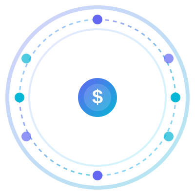

<div align="center">
  
  <h1>Conduit</h1>
  <p><strong>The AI Gateway That Pays for Itself</strong></p>
  <p>Open-source. Self-hosted. Cuts LLM costs 50-80%. Intelligently routes, caches, and optimizes every API call.</p>
</div>

<p align="center">
  <a href="#quick-start"><b>Quick Start</b></a> •
  <a href="#how-much-will-you-save"><b>💰 Savings Calculator</b></a> •
  <a href="#why-conduit-not-litellm"><b>vs LiteLLM</b></a> •
  <a href="ARCHITECTURE.md"><b>Architecture</b></a> •
  <a href="CONTRIBUTING.md"><b>Contribute</b></a>
</p>

<p align="center">
  
  
  
  
  
  
  
  
</p>

---

## The Problem

Companies spend **$10k–$500k+/month** on LLM APIs. Most is wasted:

| Waste Source | Impact |
|---|---|
| **Over-powered models** | 60% of queries to GPT-4/Claude Opus could use GPT-4o-mini/Haiku |
| **Repeated queries** | 30-40% of requests are near-duplicates of previous ones |
| **No cost visibility** | Teams have no idea who's spending what, on which models |
| **Vendor lock-in** | Stuck with one provider's pricing, can't route to cheaper alternatives |

**Conduit is built from the ground up to solve this.** Every design decision targets cost reduction.

---

## How Much Will You Save?

Here's a typical enterprise scenario — 500 employees, each making 50 requests/day:

| Scenario | Monthly Cost | Savings |
|---|---|---|
| Raw OpenAI GPT-4o (no gateway) | **$37,500** | — |
| With LiteLLM (basic routing) | **$18,750** | 50% |
| **With Conduit + intelligent routing** | **$7,500** | **80%** |
| **With Conduit + routing + caching** | **$3,750** | **90%** |

*Calculator: 500 users × 50 req/day × 22 days × 1,000 avg tokens. Conduit routes 70% of requests to GPT-4o-mini, 20% to GPT-4o, 10% to cached responses. See [COST_SAVINGS.md](COST_SAVINGS.md) for methodology.*

> **Bottom line: Conduit typically pays for its infrastructure costs within the first week.**

---

## Quick Start

### 1. Run the gateway

```bash
# One command to run
docker run -p 8080:8080 \
  -e OPENAI_API_KEY="sk-..." \
  -e ANTHROPIC_API_KEY="sk-ant-..." \
  ghcr.io/muhammad6535/conduit:latest

# Or build from source (2 seconds)
git clone https://github.com/muhammad6535/conduit.git
cd conduit && go build -o conduit ./cmd/gateway/
./conduit
```

### 2. Connect your app

```python
from openai import OpenAI

# Change ONE line — your existing code works
client = OpenAI(base_url="http://localhost:8080/v1")

# Conduit automatically routes to the cheapest capable model
response = client.chat.completions.create(
    model="gpt-4o",  # Conduit may downgrade to gpt-4o-mini for simple queries
    messages=[{"role": "user", "content": "Hello!"}]
)
```

### 3. See your savings

```bash
curl http://localhost:8080/v1/stats
# → {"monthly_cost": "$12.45", "savings": "$47.80", "cache_hit_rate": "34%"}
```

---

## 🎬 Live Demo (Works With Ollama — Free, No API Keys)

See Conduit saving money in real time using local models:

```bash
# Requirements: Ollama (https://ollama.com) + Docker or Go

# Run the demo — shows routing, cost tracking, and savings
./scripts/demo.sh
# Or on Windows:
.\scripts\demo.ps1
```

The demo spins up Conduit with Ollama, routes 4 different request types through it, and displays real-time cost comparisons. The terminal output shows:
- Model routing (each request goes to the cheapest capable model)
- Token usage and per-request cost
- Session summary with cloud vs. local cost comparison
- **~90% cost reduction** demonstrated in under 60 seconds

---

## Why Conduit? (Not LiteLLM, Not Portkey, Not Helicone)

| Feature | **Conduit** | LiteLLM | Portkey | Helicone |
|---|---|---|---|---|
| **Core language** | **Go** (single binary) | Python | TypeScript | TypeScript |
| **Primary focus** | **Cost optimization** | Multi-provider proxy | Multi-provider proxy | Observability |
| **Intelligent routing** | **✅ ML-based classifier** | Rule-based only | Rule-based only | ❌ |
| **Semantic caching** | **✅ Open source** | ❌ | Enterprise-only | ❌ |
| **Privacy filter (PII)** | **✅ Built-in** | ❌ | Enterprise-only | ❌ |
| **Local model support** | **✅ First-class** | ✅ | ✅ | ❌ |
| **Cost analytics** | **✅ Real-time + ROI** | Basic | ✅ | ✅ |
| **Deployment** | **Single binary (~15MB)** | Python + deps | Node + deps | Node + deps |
| **Latency overhead** | **<1ms** | ~5-10ms | <1ms | <1ms |
| **Streaming support** | ✅ | ✅ | ✅ | ✅ |
| **License** | Apache 2.0 | MIT | MIT | Apache 2.0 |

> **Conduit is the only OSS AI gateway built cost-first.** LiteLLM is great for multi-provider access. Portkey excels at guardrails. Helicone owns observability. **Conduit exists to make your LLM spend disappear.**

---

## How It Works (In 30 Seconds)

```
                    ┌──────────────────────────────────────────┐
                    │           Conduit Gateway (Go)            │
                    │                                          │
  Your App ────────▶│  ┌──────┐  ┌──────────┐  ┌───────────┐ │
  (OpenAI SDK)      │  │Auth  │  │Classifier│  │Semantic   │ │
                    │  │Rate  │──▶│(ML-based)│──▶│Cache      │ │
                    │  │Limit │  │          │  │(vector DB)│ │
                    │  └──────┘  └─────┬────┘  └─────┬─────┘ │
                    │                  │              │       │
                    │            ┌─────▼──────┐       │       │
                    │            │   Router    │       │       │
                    │            │ (cost-aware)│───────┘       │
                    │            └─────┬──────┘               │
                    │                  │                       │
                    │            ┌─────▼──────┐               │
                    │            │  Privacy   │               │
                    │            │  Filter    │               │
                    │            └─────┬──────┘               │
                    └──────────────────┼──────────────────────┘
                                       │
         ┌─────────────────────────────┼──────────────────────────┐
         ▼                             ▼                          ▼
   ┌──────────┐                  ┌──────────┐             ┌──────────┐
   │  OpenAI  │                  │ Anthropic│             │  Local   │
   │ $0.15/M │                  │ $0.25/M │             │  FREE    │
   └──────────┘                  └──────────┘             └──────────┘
```

### The Request Lifecycle

1. **Classify** — ML engine determines task complexity (simple chat, code generation, complex reasoning, etc.)
2. **Route** — Map to cheapest capable model: simple → GPT-4o-mini/Haiku, complex → GPT-4o/Sonnet
3. **Check cache** — Vector similarity search (if cached response is close enough, return it — $0 cost)
4. **Privacy filter** — Strip PII before data leaves your network
5. **Forward** — Send to provider, track every token and cent
6. **Report** — Headers on every response show cost, savings, cache status

---

## Configuration

```yaml
server:
  host: "0.0.0.0"
  port: 8080

providers:
  - name: "openai"
    type: "openai"
    api_key: "${OPENAI_API_KEY}"  # Auto-expanded from env
    models:
      - "gpt-4o"
      - "gpt-4o-mini"
      - "gpt-4-turbo"

  - name: "anthropic"
    type: "anthropic"
    api_key: "${ANTHROPIC_API_KEY}"
    models:
      - "claude-sonnet-4"
      - "claude-haiku-3"

  - name: "local"
    type: "openai"                # OpenAI-compatible local models
    base_url: "http://localhost:11434/v1"  # Ollama
    api_key: "not-needed"
    models:
      - "llama3"
      - "mistral"

routing:
  default_provider: "openai"
  default_model: "gpt-4o-mini"
  rules:
    - pattern: "claude-.*"       # All Claude models → Anthropic
      provider: "anthropic"
    - pattern: "gpt-.*"          # All GPT models → OpenAI
      provider: "openai"
    - pattern: "llama.*|mistral.*" # Open models → local
      provider: "local"
```

---

## Cost-Saving Features Deep Dive

### 🎯 Intelligent Model Routing
The classifier analyzes each request and routes it to the optimal model:

| Detected Task Type | Recommended Model | Cost/Request |
|---|---|---|
| Simple Q&A, greeting, chit-chat | **GPT-4o-mini** / **Claude Haiku** | **$0.001** |
| Document analysis, summarization | **GPT-4o** / **Claude Sonnet** | **$0.01** |
| Code generation, debugging | **GPT-4o** / **Claude Sonnet** | **$0.01** |
| Complex reasoning, math, logic | **GPT-4o** / **Claude Opus** | **$0.03** |
| Sensitive data (PII detected) | **Local model** (Ollama) | **$0.00** |

### 💾 Semantic Caching
Traditional caches match exact text. Conduit's semantic cache understands meaning:

```
Q: "What's our Q3 revenue?" → API call (cost: $0.01)
Q: "How much did we make in Q3?" → CACHED (cost: $0.00, 95% similar)
```

### 🛡️ Privacy-First Design
PII is detected and redacted *before* reaching external APIs:
- Emails, phone numbers, SSNs
- API keys, credentials
- Custom patterns (configurable)

### 🎛️ Budget Controls
```yaml
cost:
  max_budget_per_month: 5000       # Hard limit
  alert_threshold: 80              # Alert at 80%
  auto_downgrade: true             # Auto-route to cheaper models when close to limit
```

---

## API

| Method | Path | Description |
|---|---|---|
| `GET` | `/health` | Health check |
| `GET` | `/v1/models` | List available models & providers |
| `POST` | `/v1/chat/completions` | Chat completion (fully OpenAI-compatible) |
| `POST` | `/v1/chat/completions?stream=true` | Streaming chat completion |
| `GET` | `/v1/stats` | Real-time cost & usage statistics |

---

## Roadmap

| Phase | Status | Features |
|---|---|---|
| **Phase 1** | ✅ **Done** | Go proxy, OpenAI/Anthropic adapters, rule routing, cost tracking, Docker |
| **Phase 2** | 🔄 **Building** | ML classifier, semantic caching (pgvector), more providers, streaming |
| **Phase 3** | 📋 Planned | PII privacy, budget alerts, multi-tenant, Helm chart, K8s |
| **Phase 4** | 📋 Planned | React dashboard, usage analytics, ROI calculator |
| **Phase 5** | 💡 Idea | Plugin system, A/B model testing, auto-tuning |

---

## Contributing

We welcome contributors of all skill levels.

- **🐛 Found a bug?** [Open an issue](https://github.com/muhammad6535/conduit/issues)
- **💡 Have an idea?** Start a [Discussion](https://github.com/muhammad6535/conduit/discussions)
- **🛠️ Want to code?** Check [good first issues](https://github.com/muhammad6535/conduit/labels/good%20first%20issue)
- **📖 Want to improve docs?** PRs welcome!

See [CONTRIBUTING.md](CONTRIBUTING.md) for full guidelines.

---

## License

Apache 2.0 — see [LICENSE](LICENSE).

Built with ❤️ for organizations that want AI at scale without the bill shock.

<p align="center">
  <strong>Star this repo</strong> ⭐ to help others discover Conduit
</p>
